# Slide Scan
An android application designed for students to easily record and notate lectures, whether they be in a verbal or powerpoint format. Utilizes Google's speech-to-text recognition kit and ML kit for text recognition. 

## Summary
Designed as a user-friendly note-storing platform, this application features standard note-taking characteristics, such as creating, editing, searching for, deleting, pinning, and viewing a note. In addition to those features, it boasts two NLP (Natural Language Processing) based tools to help convert ideas to notes: speech and image to text recognition. 

## How it works
Built in primarily Java, this application consists of three main UIs: the Homepage, Create a New Note, and Crop an Image. The Homepage consists of a search view, followed by a recycler view filled with card views. The search view serves as a search bar to filter the notes, a useful addition for note-takers to quickly find what they are looking for. Each card view contains the title, contents, and date of the note. After tapping on a card view, the user will enter the Create a New Note screen, prompted to create a title, edit the contents of the note, and have options to record/capture a picture to transcribe into text. If the user decides to capture an image and transcribe it to text, they will be redirected to a page with a camera UI, ready for them to take a picture. After snapping the picture, they'll be given the option to edit their image, whether it be to crop, rotate, flip, or modify their image before transcribing it. If the user decides to record a memo and have that transcribed, they will be redirected to a Voice UI, ready to record their speech and transcribe it to text. 

## Quick Walkthrough

https://user-images.githubusercontent.com/62070812/177069819-ba51afc0-9c3e-4509-9956-a99e5df9d1f6.mp4

## Application in Action
From cycling, pinning, and managing your notes to creating a new note itself, the Home Page is the hub for everything you've saved in the app.
| Home Page     | Note Features         | Pinning Notes       | Create A New Note  
:-------------------------:|:-------------------------:|:-------------------------:|:-------------------------:
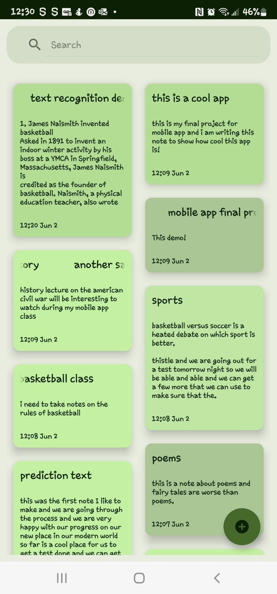  | 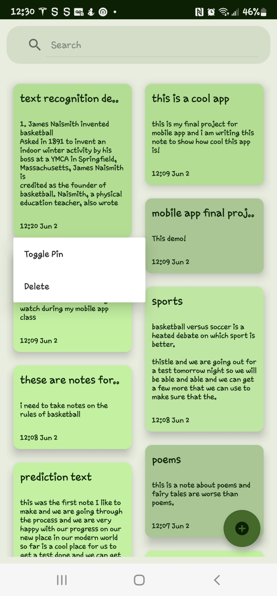 | 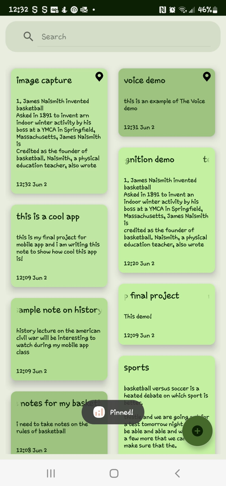 | 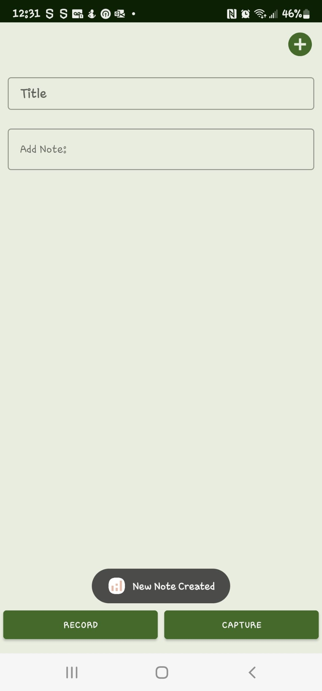

The app's transcription functionality features the ability to capture or upload an image, in order to have all the text in the image transcribed and pasted into a note.
| Select Image Source     | Snap a Picture    | Confirm Picture       | Crop/Edit Frame       | Transcription
:-------------------------:|:-------------------------:|:-------------------------:|:-------------------------:|:-------------------------:
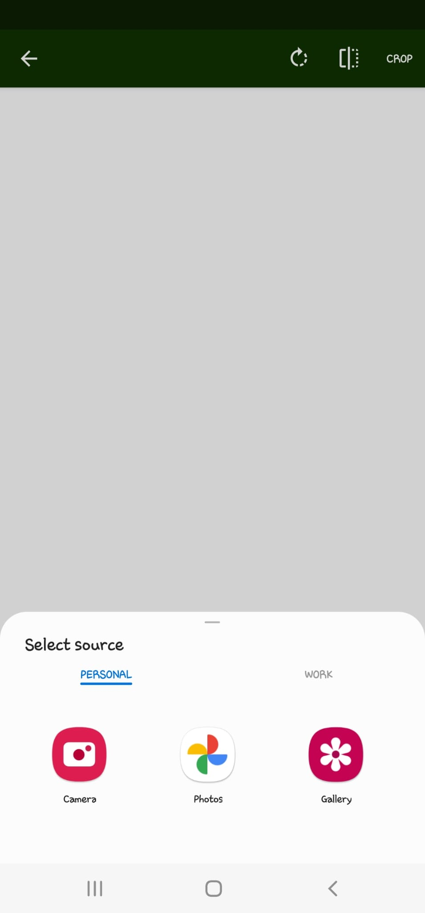  | 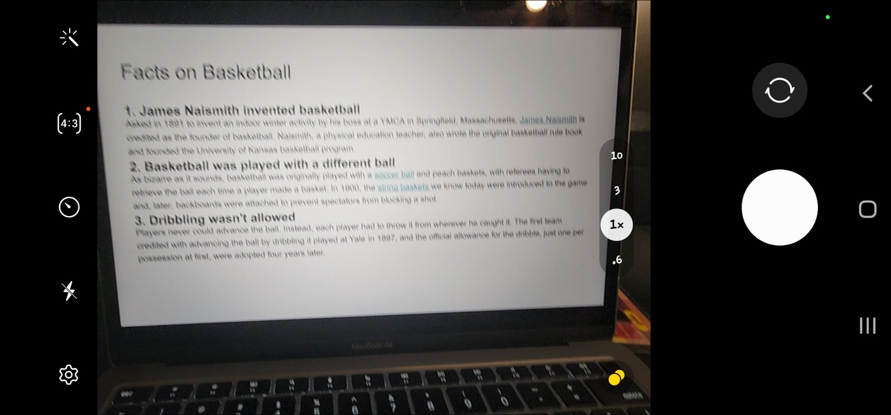 | 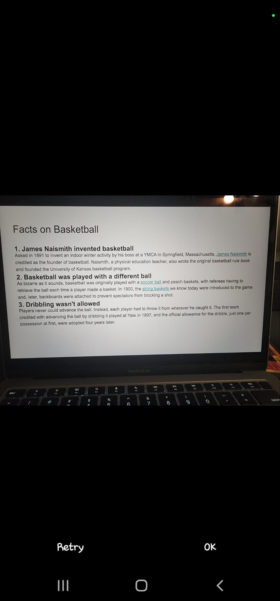 | 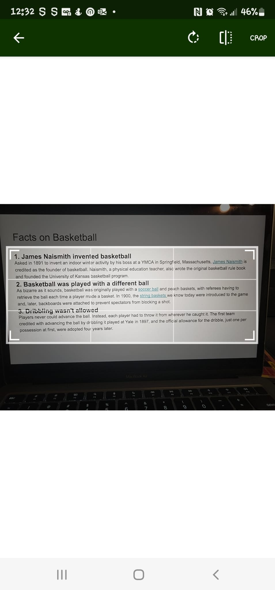 |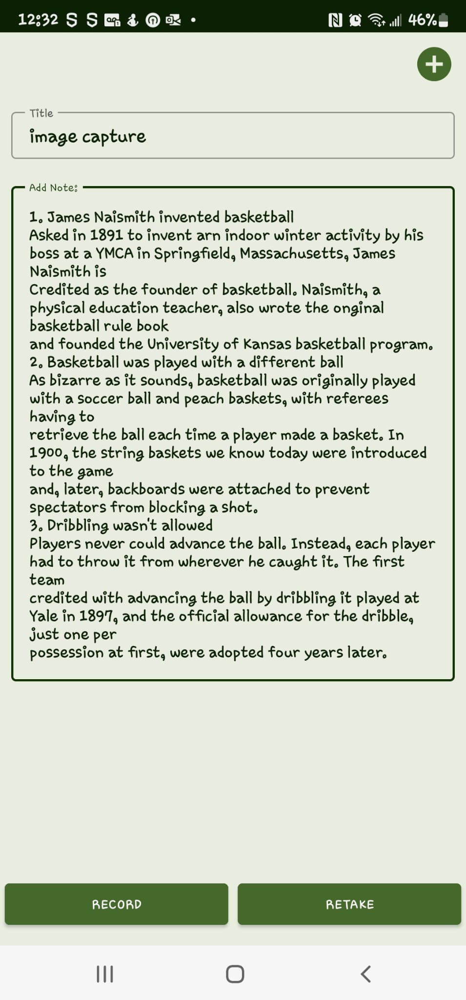

The app also features the ability to transcribe speech into text, as well as searching through your notes to find the one you were looking for.
| Live Transcription of Speech     | Search Functionality         | Search Functionality     
:-------------------------:|:-------------------------:|:-------------------------:
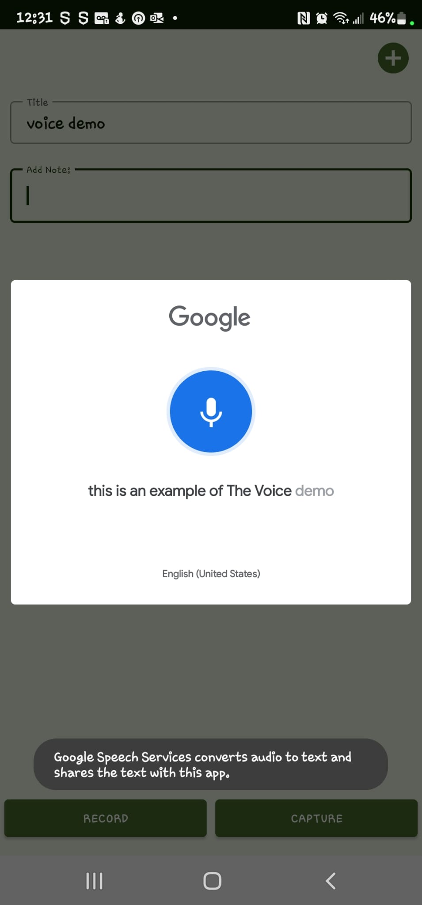  | 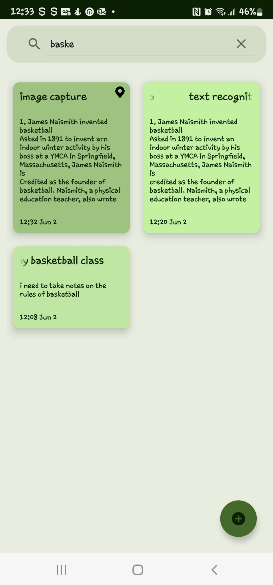 | 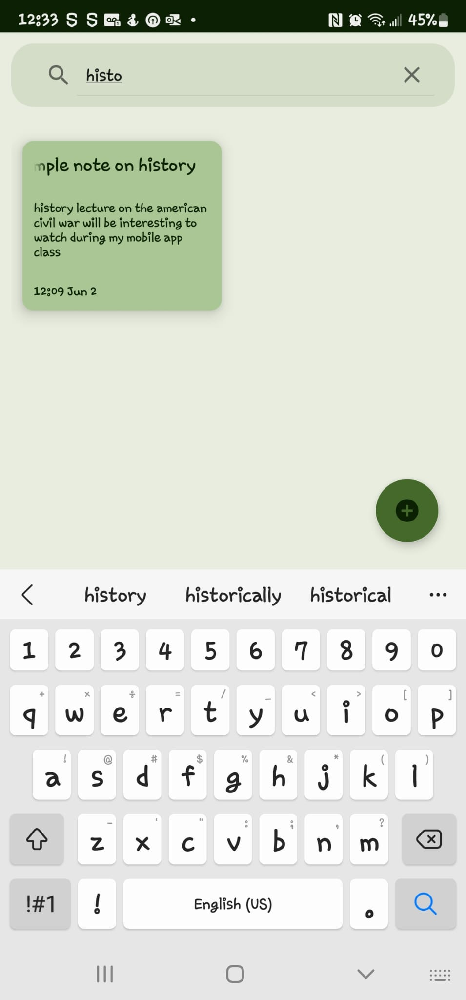

## Dependencies Utilized
- Java
- Kotlin
- ML Kit
- Speech-To-Text recognition model
- Android Image Cropper
